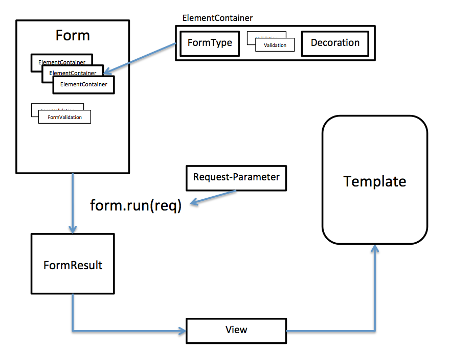

# Concept

First you need to build the form itself. The form contains elements and optional form-validators.
The elements ("ElementContainer") consists of a type ("FormType"), validator (with "Criteria") 
and a decoration ("Decoration").

## Form

The form must be filled with ElementContainers and Validators.
Optionally you can specifiy an "id", if you have more than one form on the page.

#### ElmentContainer

The ElementContainer holds: a type, some validation-rules and a decoration.

##### Type

There a lots of predefined types in jWebform:
* TextType (input type="text")
* CheckBoxType (input type="checkbox") 
* HiddenType (input type="hidden")
* ...

See types.md for complete list of build-in types.
[See complete list of build-in types.](types.md)

The build in types define all basic input-elements and some additional ones.

You can define your own types. 
You can even define groups of types for more complex situations.

##### Validations

Each type can be validated with some validation-criteria. You can define 0..n validation-criteria.
There a lots of validation - rules, for example:

* Length
* MinLenght
* MaxLenght
* Required
* Email...

[See complete list of build-in criteria.](validators.md)

You can define easily own validation critera.

##### Decoration

You can decorate each element with a "Decoration". This holds a Label, a Helptext and a Placeholder text.
You can extend this decoration to add more attributes to your input type.

#### Form-Validators

A form can be validated by FormValidators. You can have 0..n FormValidators.
For example a registration form contains two Password - Elements. With a form validator 
you can compare these two elements if they are equal.

##FormResult

After you have filled the form with FormElments, call the run function of the form and pass 
the Env object and you will get a FormResult.

```Java
   FormResult result = form.run(env);
```

###Env

The Env objects holds the parameters from the request. Additionally you can pass information 
about the session, if you need XSRF protection.

The cool thing: via this Env-Lambda you can abstract your webframework away and avoid dependencies.

###FormResult

The FormResult holds the results of the elements. The result of earch element contains: 
* the value, that was entered
* the validation-result
* the name of the value
* the decoration 

##View

The FormResult can deliver a "View" Object, that has some convenience methods for a typical 
view component in a MVC framework. Typically, you pass the view to the template.

Within the template you loop over the elements and render each element for its own.



