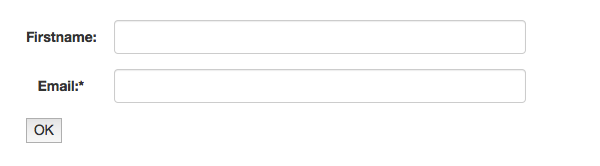

# Quickstart


## Add dependency

Add this dependency to your project:

```xml
...
<dependency>
    <groupId>de.cyclon-softworx</groupId>
    <artifactId>jwebform</artifactId>
    <version>0.0.10</version> <!-- Please check for the latest version on maven central or in the changelog! -->
</dependency>
...
```

## Define a form

Fill a Form object with your Form-fields:


```Java
    private Form buildForm() {
      return FormBuilder.simple().typeBuilder(
        text("firstname").
          label("Firstname"), 
        text("email").
          label("Email").
          criteria(Criteria.required(), Criteria.email())
        ).build();
    }
    
```


## Controller

Write a controller, that uses this form: (Here Spring MVC)

```Java

  Form form = buildForm(); // See "Define a form"

  @RequestMapping("/form")
  public String demoJWebForm(HttpServletRequest request, Model model) {
   
    FormResult formResult = form.run((key) -> request.getParameter(key)); // pass the request-params via lambda 
    
    model.addAttribute("form", formResult.getView()); // add the view object to the model
    
    if (formResult.isOk()) {   // check if the form was submitted and is valid
      log.debug("Valid firstname from form:"  + formResult.getStringValue("firstname"));   // if everything was okay, we can get the values from the form
    }
    
    return "index"; // the template, that renders the form
  }

```
See  [spring-boot integration](spring_boot.md) for even more compact version of usage.


## Template

Output the form within your template. (index.html)


```html

<h1>The form</h1>

<!-- start the form -->
{{ renderForm(form) }} <!-- you have to create your own renderForm macro! -> see jWebFormTheme project -->
<!-- end form -->


```


## Output




## Go on

[Documentation](start.md)

[Read about the concepts](concept.md)

[Read the changelog](CHANGELOG.md)
